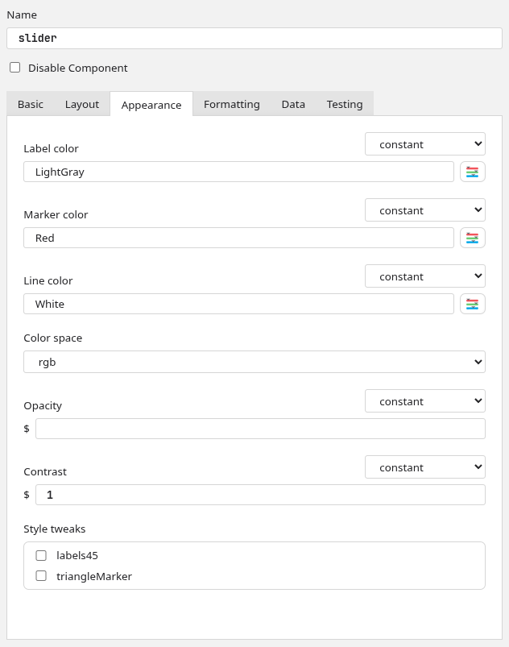

.. _addNewComponent:

Adding a new Builder Component
=====================================

Builder Components are auto-detected and displayed to the experimenter as icons (in the right-most panel of the Builder interface panel), so adding new ones is fairly straightforward. You can add Components directly to PsychoPy (see :ref:`addFeature`, if this doesn't mean anything to you then see :ref:`usingRepos`) or create a plugin which adds them via an entry point.

Creating a Component class
---------------------------------------------------------

Components in PsychoPy are Python classes, so creating a Component is just a case of creating the right kind of class. In order to be recognised as a Component, your class needs to be a subclass of BaseComponent. You can do this via BaseComponent directly::

    from psychopy.experiment.components import BaseComponent

    class MyNewComponent(BaseComponent):
        pass

Or via another class which itself is a subclass of BaseComponent (such as BaseVisualComponent or BaseDeviceComponent)::

    from psychopy.experiment.components import BaseVisualComponent, BaseDeviceComponent

    class MyNewDeviceComponent(BaseDeviceComponent):
        pass
    
    class MyNewVisualComponent(BaseVisualComponent):
        pass

In order to be detected by the |PsychoPy| Studio/Standalone app, your Component class needs to either:

* Be defined in a .py file in its own folder in the the folder `psychopy/experiment/components` within the PsychoPy library (if you're contributing directly to PsychoPy)
* Be connected to the module ``psychopy.experiment.components`` by an `entry point <_entryPoints>`_ (if you're writing a plugin)

Both apps use the same function in the |PsychoPy| library to get a list of all Components, so you can test whether your Component will be detected without having to actually start either app by running the following::

    from psychopy.experiment import getAllComponents

    print(
        getAllComponents()
    )

If your Component is configured correctly, you should see its name in the output.

Adding parameters 
---------------------------------------------------------

The controls that you see in |PsychoPy| Studio/Standalone are created based on the value of the ``.params`` attribute of your Component.

This attribute should be a ``dict``, with each key being a ``Param`` object. These objects can be created with the following values:

* *val*: A default value for this param
* *valType*: This tells |PsychoPy| how to write the value of this param when compiling the experiment code. Note that, if the param's value begins with a $, it will always be treated as code regardless of valType. Options are:

    * ``str``: A string, will be compiled with " around it
    * ``extendedStr``: A long string, will be compiled with " around it and linebreaks will be preserved
    * ``code``: Some code, will be compiled verbatim or translated to JS (no ")
    * ``extendedCode``: A block of code, will be compiled verbatim or translated to JS and linebreaks will be preserved
    * ``file``: A file path, will be compiled like str but will replace unescaped \\ with /
    * ``list``: A list of values, will be compiled like code but if there's no [] or () then these are added

* *inputType*: This tells |PsychoPy| how to represent the parameter in the Builder; what kind of control to show for it. Options are:

    * ``single``: A single-line text control
    * ``multi``: A multi-line text control
    * ``color``: A single-line text control with a button to open the color picker
    * ``survey``: A single-line text control with a button to open Pavlovia surveys list
    * ``file``: A single-line text control with a button to open a file browser
    * ``fileList``: Several file controls with buttons to add/remove
    * ``table``: A file control with an additional button to open in Excel
    * ``choice``: A single-choice control (dropdown) whose choices are listed in ``allowedVals`` and ``allowedLabels``
    * ``device``: A single-choice control (dropdown) whose choices are the devices from DeviceManager which match the classes listed in ``allowedVals``
    * ``multiChoice``: A multi-choice control (tickboxes)
    * ``richChoice``: A single-choice control (dropdown) with rich text for each option
    * ``bool``: A single checkbox control
    * ``dict``: Several key:value pair controls with buttons to add/remove fields

* *allowedVals*: For params with a fixed set of options, this tells |PsychoPy| what the values of those options are. These *should not* be translated, as they are the actual values used in code.
* *allowedLabels*: A list of labels corresponding to the values in ``allowedVals`` which tells |PsychoPy| what to display each option as. These can (and should) be translated, as they are not used in code.
* *categ*: Which tab this param should appear in, leave as ``None`` to have the param appear at the top of the Component dialog (use this sparingly; it is best saved for core functionality like the Component name and disabled control)
* *label*: What to label this param as. Keep in mind, the param will still be referred to in code by its key, this is just for the graphical interface of Builder.
* *hint*: The hint shown when this param's label is hovered over.
* *updates*: When the value of this param should be set, should be one of:

    * *constant*: Value is set just the once
    * *set every repeat*: Value is set at the start of each Routine
    * *set every frame*: Value is set each frame

* *allowedUpdates*: Which values for ``updates`` the user is allowed to choose (leave as None to hide the control)

So, for example, the parameter in the Keyboard Component which determines whether keypresses should be registered on press or on release looks like this::

    self.params['registerOn'] = Param(
        # starts off as "press"
        "press", 
        # written to code as a string
        valType="str", 
        # shown in Builder as a dropdown menu
        inputType="choice",
        # has two options...
        allowedVals=["press", "release"],
        # ...which should be labelled as follows
        allowedLabels=[_translate("Press"), _translate("Release")],
        # shown in the "Basic" tab
        categ="Basic", 
        # the label shown in Builder
        label=_translate("Register keypress on..."),
        # the tooltip when hovered over
        hint=_translate(
            "When should the keypress be registered? As soon as pressed, or when released?"
        ),
        # set just the once, when the Keyboard is created
        updates="constant",
        # there is no option to set each repeat/frame
        allowedUpdates=None
    )

Many params will already exist by virtue of subclassing. For example, the ``name`` param is always present as it's added by ``BaseComponent``, and the ``pos`` and ``size`` params are always present on subclasses of ``BaseVisualComponent`` for the same reason.

Translating labels
~~~~~~~~~~~~~~~~~~~~~~~~~~~~~~~~~~~~~~~~~~~~~~~~~~~~~

PsychoPy has a team of volunteer translators who provide translations for all labels in the PsychoPy apps. To use an existing translation (or make sure your label is picked up by the code which tells the team what to translate), you need to import the ``_translate`` function from ``psychopy.localization`` and wrap any string in the following::

    _translate("My label")

This should be done on labels and tooltips which are *presented to the user*, never on values which are *used in code*, as translating a string could break code further down the line (e.g. if you had code which said ``if fruit == "banana":`` and ``fruit`` was translated into another language, this statement would always be ``False``). Also, as strings are submitted for translation before interpretation, any string formatting needs to be done after ``_translate``, so for example::

    # CORRECT
    _translate("The value is {}").format(someValue)
    # INCORRECT
    _translate("The value is {}".format(someValue))

As in the former example, translaters can translate ``"The value is "`` and leave ``{}`` as is. Whereas in the latter, the string to translate would depend on the value of ``someValue``, so the translation would only cover the default value.

Writing code
---------------------------------------------------------

What a Component is, at its core, is something which *takes parameter values* and returns *Python or JavaScript code*. It does this by defining a set of functions which write code at certain points in an experiment, using the values of its parameters to construct `Python formatted strings <https://www.w3schools.com/python/python_string_formatting.asp>`_. Some of this code is already defined by the base class you're subclassing (e.g. if you're creating a subclass of BaseVisualComponent, then it will already know how to draw itself each frame according to start/stop parameters), but generally you will want to overwrite some or all of these to get the desired behaviour.

The functions which write a Component's code are roughly equivalent to the tabs of a :ref:`_code`:

* ``writePreCode/writePreCodeJS``: Written before the experiment starts (Before Experiment)
* ``writeInitCode/writeInitCodeJS``: Written at the start of the experiment (Begin Experiment)
* ``writeRoutineStartCode/writeRoutineStartCodeJS``: Written at the start of this Component's Routine (Begin Routine)
* ``writeFrameCode/writeFrameCodeJS``: Written each frame of this Component's Routine (Each Frame)
* ``writeRoutineEndCode/writeRoutineEndCodeJS``: Written at the end of this Component's Routine (End Routine)
* ``writeExperimentEndCode/writeExperimentEndCodeJS``: Written at the end of the experiment (End Experiment)

All of these functions take an input argument ``buff``, which is the text buffer to which the current experiment is being written. You can therefore write your code to this buffer by calling::

    buff.writeIndentedLines(code)

You will also need to use this buffer to manage indenting::

    buff.setIndentLevel(<number of indentations>, relative=<True/False>)

The ``BaseComponent`` class also offers some helper functions which you can use to make your code writing a bit easier:

* ``writeStartTestCode(self, buff, extra="")/writeStartTestCodeJS(self, buff, extra="")``: Writes code to check whether the Component needs to start, based on its start params, leaving the relevant ``if`` statements open. The returned value is how many ``if`` statements were left open, so after writing whatever you would like to happen on the starting frame, you will need to call ``buff.setIndentLevel(-<returned value>)`` (and write some ``}``'s in JS) to return to normal after. Use the optional argument ``extra`` to add additional conditions to check for (e.g. ``and someLimitingFactor == True``).
* ``writeStopTestCode(self, buff, extra="")/writeStopTestCodeJS(self, buff, extra="")``: Same as ``writeStartTestCode`` but rather than checking whether the Component is ready to start, checks whether it is ready to stop.
* ``writeActiveTestCode(self, buff, extra="")/writeActiveTestCodeJS(self, buff, extra="")``: Same as ``writeStartTestCode`` and ``writeStopTestCode`` but rather than checking whether the Component is ready to start or stop, checks whether it has started and is yet to stop.
* ``writeParamUpdates(self, buff, updateType)/writeParamUpdatesJS(self, buff, updateType)``: Writes the necessary updates to params if their update type matches what is given. This is already called by ``writeActiveTestCode`` and in the default behaviour of ``writeRoutineStartCode``.
* ``getPosInRoutine(self)``: Gets the position of this Component in its Routine; useful for choosing what value to give for ``depth`` with visual Components.

Using parameters
~~~~~~~~~~~~~~~~~~~~~~~~~~~~~~~~~~~~~~~~~~~~~~~~~~~~~

The ``Param`` class has some clever functions for handling turning itself into a string (``__str__``), which means you don't have to worry about getting and processing the value of the parameter yourself. Simply pass it to a Python ``format`` function, and it will write itself correctly according to its ``valType`` attribute. Examples of how you might do this::

    # using %s formatting
    code = (
        "%(name)s = visual.SomeStim(\n"
        "    name='%(name)s',\n"
        "    pos=%(pos)s,\n"
        ");"
    ) % self.params
    # using .format
    code = (
        "{name} = visual.SomeStim(\n"
        "    name='{name}',\n"
        "    pos={pos},\n"
        ");"
    ).format(**self.params)
    # using f strings
    code = (
        f"{self.params['name']} = visual.SomeStim(\n"
        f"    name='{self.params['name']}',\n"
        f"    pos={self.params['pos']},\n"
        f");"
    )

It is worth noting that in ``writeInitCode``, parameters may need to have different values, as if a parameter's value is ``set each frame`` or ``set each repeat`` then it will need to be initialised as a safe default. To get these defaults, you can use the function ``psychopy.experiment.components:getInitVals``, which will return a dict which you can use in place of ``self.params``.

Name space
~~~~~~~~~~~~~~~~~~~~~~~~~~~~~~~~~~~~~~~~~~~~~~~~~~~~~

There are several internal variables (i.e. names of Python objects) that have a specific, hardcoded meaning within `xxx_lastrun.py`. You can expect the following to be there, and they should only be used in the original way (or something will break for the end-user, likely in a mysterious way)

===================  ==============
Name                 Use
===================  ==============
win                  The window
t                    Time (s) since the Routine began
continueRoutine      Boolean which will end the Routine on next frame flip if set to False
logging              PsychoPy's ``logging`` module
thisExperiment       ``psychopy.data.experiment:ExperimentHandler`` object representing the current experiment
currentLoop          Trial handler object representing the current loop, if any
===================  ==============

Other names will also get derived from user-entered names, like `trials` (name of a loop) --> `thisTrial`.Handling of variable names is under active development, so this list may well be out of date. (If so, you might consider updating it or posting a note to the |PsychoPy| Discourse developer forum.)

Creating an icon
---------------------------------------------------------

The best way to make an icon which will work in both PsychoPy Studio and PsychoPy Standalone is to use a vector editor like `Affinity <https://www.affinity.studio/>`_, `Inkscape <https://inkscape.org/>`_ or `Adobe Illustrator <https://www.adobe.com/products/illustrator>`_ which allows you to export your icon to whatever file format is required. While the appearance of your Component icon is totally up to you, we recommend using thick grey lines with curved corners and limiting colors to just red and blue.

For PsychoPy Studio
~~~~~~~~~~~~~~~~~~~~~~~~~~~~~~~~~~~~~~~~~~~~~~~~~~~~~

As PsychoPy Studio uses modern web-based technologies, icons for PsychoPy Studio are .svg files. This makes them small, fast to load, infinitely scalable and theme responsive. The app interface of PsychoPy Studio is Chromium-based, so if you can open your icon in Google Chrome (or other Chromium-based browsers) then it should look the same in PsychoPy Studio.

Because .svg is a text-based format, you can make your icon theme-responsive by opening the exported .svg file in a text editor and replacing the color values (e.g. ``#F2545B``) with named CSS variables (e.g. ``var(--red)``). See below for the color names used by PsychoPy Studio and what color they correspond to in PsychoPy Light and PsychoPy Dark themes.

===============    ===============  ===============
Name               PsychoPy Light   PsychoPy Dark
===============    ===============  ===============
--red              #F2545B          #F2545B
--purple           #C3BEF7          #C3BEF7
--blue             #02A9EA          #02A9EA
--green            #6CCC74          #6CCC74
--yellow           #F1D302          #F1D302
--orange           #EC9703          #EC9703
--base             #FFFFFF          #75757d
--mantle           #F2F2F2          #75757d
--crust            #E4E4E4          #57575f
--overlay          #D6D6D6          #484850
--outline          #66666E          #ACACB0
--text             #242427          #FFFFFF
--hltext           #FFFFFF          #242427
===============    ===============  ===============

In general, PsychoPy icons stick to just ``--red``, ``--blue`` and ``--outline``, so your icon will best fit in with existing Components if you limit your palette to these three colors.

Once you have a .svg file ready to add, you can assign it to your Component by setting the class attribute ``iconSVG`` of your Component class to be the file's path. The easiest way to do this is to put it in the same folder as your Component and set the attribute to::

    pathlib.Path(__file__).parent / '<file name>.svg'

For PsychoPy Standalone
~~~~~~~~~~~~~~~~~~~~~~~~~~~~~~~~~~~~~~~~~~~~~~~~~~~~~

As PsychoPy Standalone was written in wxPython, adding icons for this app means exporting a .png file for each of the three app themes: Light, dark and classic. These should all be 48x48px, though in order for your Component to look correct on an Apple Retina screen you should also export it as 96x96px with ``@2x`` at the end of the file stem (just before ``.png``). Many image editors will include this as an export preset.

Light and dark icons should be broadly the same, only with a different shade of grey for outlines so as to be more visible on light/dark background. PsychoPy icons generally stick to the following colors for each theme:

===============  ===============
PsychoPy Light   PsychoPy Dark
===============  ===============
#F2545B          #F2545B
#02A9EA          #02A9EA
#66666E          #ACACB0
===============  ===============

The classic theme exists for compatability with PsychoPy's old (pre-2020) look, so icons for that theme should be drawn from the `Crystal icon pack <https://www.softicons.com/system-icons/crystal-project-icons-by-everaldo-coelho>`_. If none meet your needs, you can create a copy of your dark mode icon, as this will be visible on either background.

Icons should be sorted into folders (called ``light``, ``dark`` and ``classic``) by theme. To connect them to your Component, set the ``iconFile`` attribute of the Component class to be the file path of the icon *without the theme subfolder or @2x*. For example, if your file structure looked like this::

    -> myComponent
      -> light
        -> myComponentIcon.png
        -> myComponentIcon@2x.png
      -> dark
        -> myComponentIcon.png
        -> myComponentIcon@2x.png
      -> classic
        -> myComponentIcon.png
        -> myComponentIcon@2x.png

Then you would set ``icon`` as::

    Path(__file__).parent / 'myComponentIcon.png'

